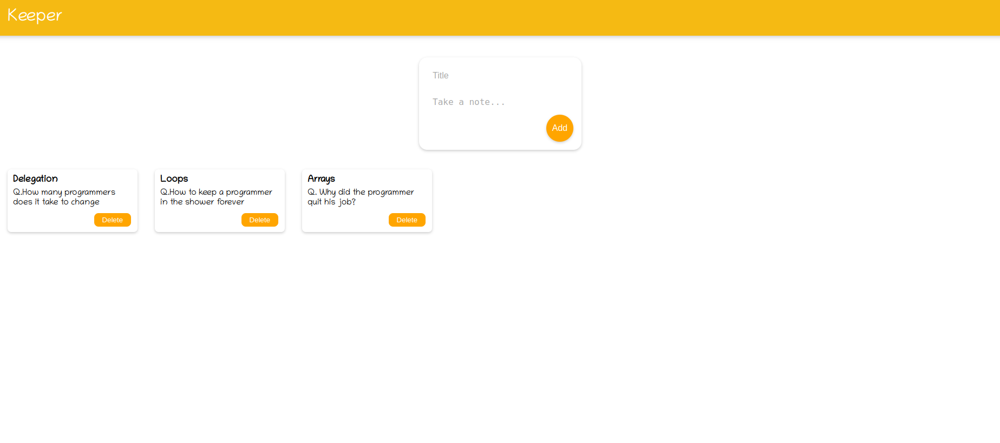
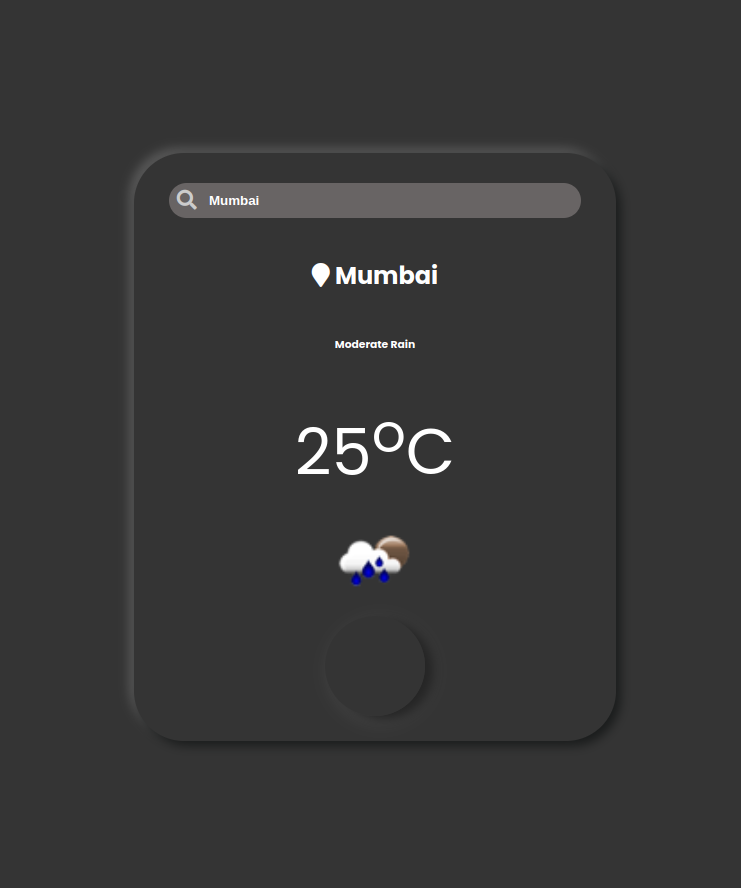
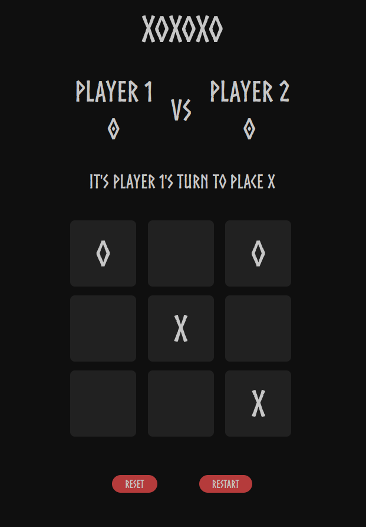
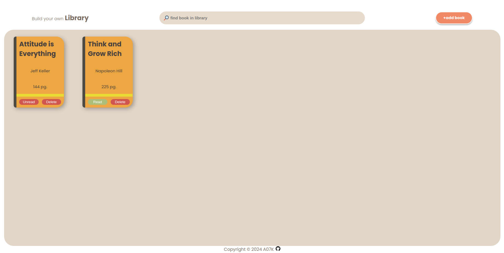
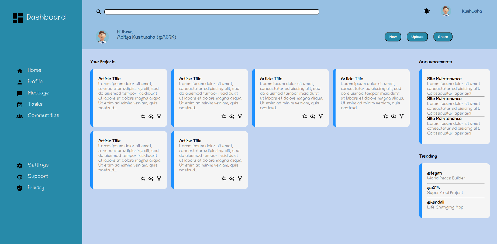
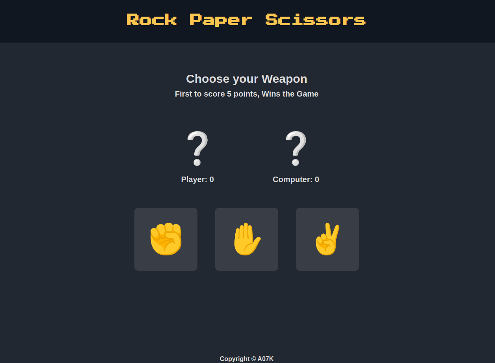
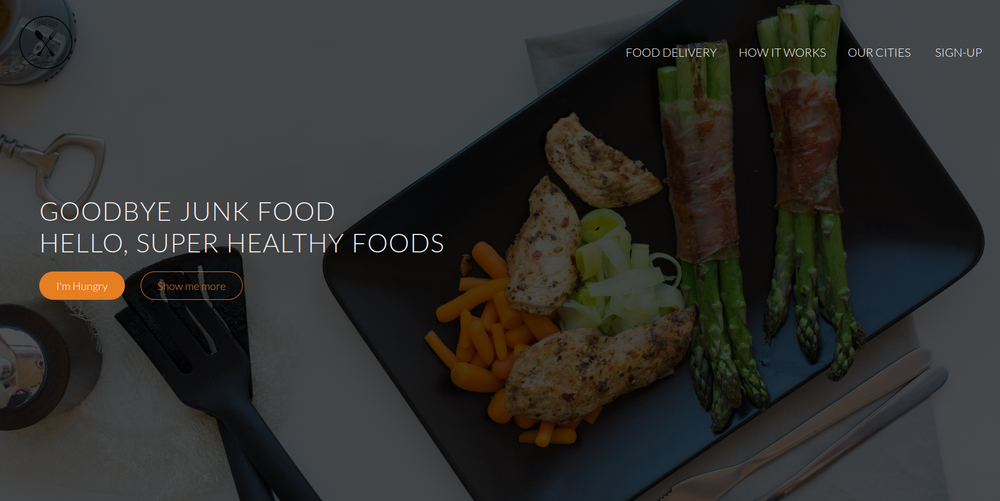
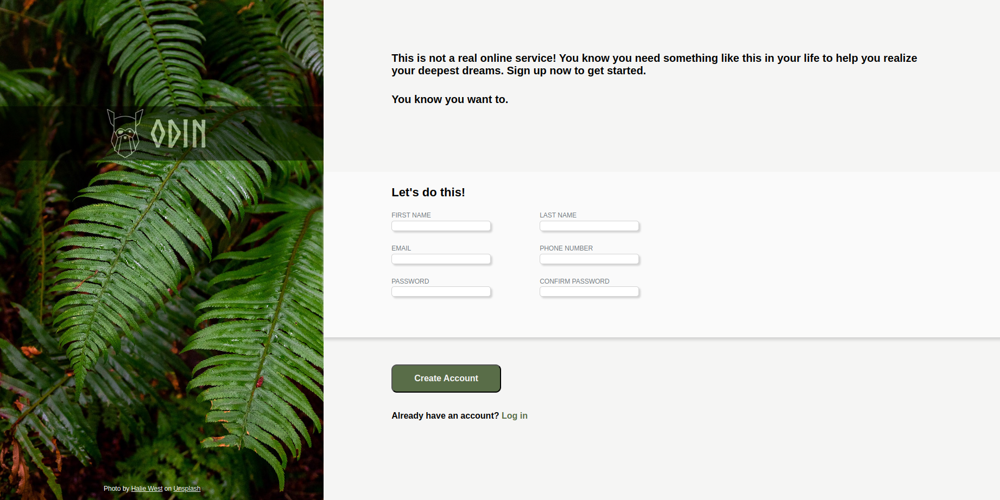
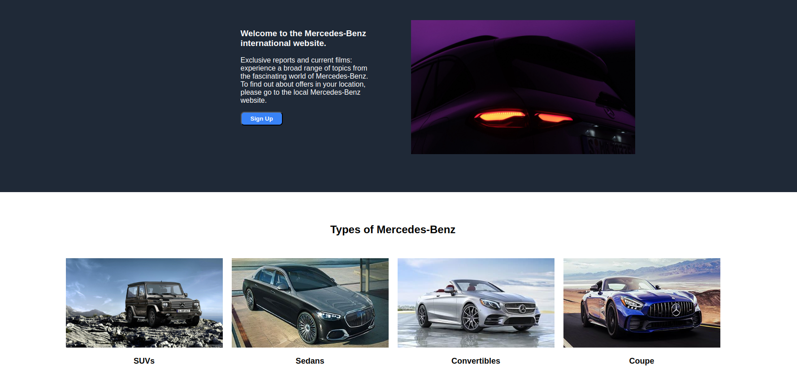

# Hello, I'm Aditya Kushwaha👋

I'm an Aspiring Full Stack Web Developer
Diving deep into the MERN stack to bring ideas to life on the web.
My focus is on crafting seamless user experiences through React,
while building robust backends with Express and MongoDB.
As a frontend enthusiast, I'm passionate about creating
intuitive and visually appealing interfaces that users love.
Currently, I'm channeling my skills into an e-commerce project,
learning and growing with every line of code I write.
Join me on this exciting journey as I transform from a newcomer
to a proficient full stack developer, one commit at a time.

 

<link rel="stylesheet" type='text/css' href="https://cdn.jsdelivr.net/gh/devicons/devicon@latest/devicon.min.css" />

# 🔧 Technologies & Tools

<table>
  <tr>
    <td align="center" height="108" width="108">
      
       <strong>C++</strong>
    </td>
    <td align="center" height="108" width="108">
      
       <strong>HTML</strong>
    </td>
    <td align="center" height="108" width="108">
      
       <strong>CSS</strong>
    </td>
    <td align="center" height="108" width="108">
      
       <strong>JavaScript</strong>
    </td>
    <td align="center" height="108" width="108">
      
       <strong>Bootstrap</strong>
    </td>
    <td align="center" height="108" width="108">
      
       <strong>React</strong>
    </td>
    <td align="center" height="108" width="108">
      
       <strong>Node</strong>
    </td>
  </tr>
  <tr>
    <td align="center" height="108" width="108">
      
       <strong>Express</strong>
    </td>
    <td align="center" height="108" width="108">
      
       <strong>MongoDB</strong>
    </td>
    <td align="center" height="108" width="108">
      
       <strong>Git</strong>
    </td>
    <td align="center" height="108" width="108">
      
       <strong>Linux</strong>
    </td>
    <td align="center" height="108" width="108">
      
       <strong>Postman</strong>
    </td>
    <td align="center" height="108" width="108">
      
       <strong>npm</strong>
    </td>
    <td align="center" height="108" width="108">
      
       <strong>MySql</strong>
    </td>
    
  </tr>
</table>

# 📈 Stats 

<h1>🖥 Projects</h1>

<table>
  <tr>
    <td width='50%'>
      <h2 align='center'>Project - CV</h2>
      
  
        
         
         
        

          
          
        

        
<strong>React, CSS</strong>

      

    </td>
    <td width='50%'>
      <h2 align='center'>Keeper App</h2>
      
  
        
         
         
        

          
          
        

        
<strong>React, CSS</strong>

      

    </td>
  </tr>
  <tr>
    <td width='50%'>
      <h2 align='center'>Weather App</h2>
      
  
        
         
         
        

          
            
        

        
<strong>CSS, Openweather API</strong>

      

    </td>
    <td width='50%'>
      <h2 align='center'>Tic-Tac-Toe</h2>
      
  
        
         
         
        

          
          
        

        
<strong>CSS, JavaScript</strong>

      

    </td>
  </tr>
  <tr>
    <td width='50%'>
      <h2 align='center'>Library Management</h2>
      
  
        
         
         
        

          
          
        

        
<strong>CSS, JavaScript</strong>

      

    </td>
    <td width='50%'>
      <h2 align='center'>Admin Dashboard</h2>
      
  
        
         
         
        

          
          
        

        
<strong>HTML, CSS</strong>

      

    </td>
  </tr>
  <tr>
    <td width='50%'>
      <h2 align='center'>Rock Paper Scissors</h2>
      
  
        
         
         
        
        
        
<strong>CSS, JavaScript</strong>

      

    </td>
    <td width='50%'>
      <h2 align='center'>Restaurant</h2>
      
  
        
         
         
        

          
          
        

        
<strong>CSS, JavaScript, JQuery, BootStrap</strong>

      

    </td>
  </tr>
  <tr>
    <td width='50%'>
      <h2 align='center'>Sign-Up Form</h2>
      
  
        
         
         
        

          
          
        

        
<strong>HTML, CSS</strong>

      

    </td>
    <td width='50%'>
      <h2 align='center'>Mercedes Webpage</h2>
      
  
        
         
         
        

          
          
        

        
<strong>HTML, CSS</strong>

      

    </td>
  </tr>
</table>
